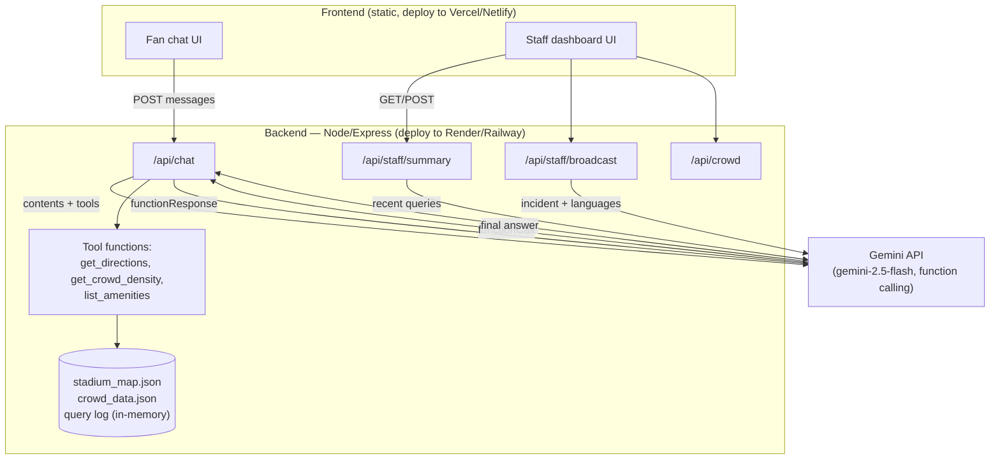

# StadiumSense
**Gen AI copilot for Smart Stadiums & Tournament Operations — PromptWars Challenge 4**

A single GenAI system, two front-ends: a multilingual fan chat assistant for navigation, accessibility, and crowd conditions, and a staff console for live crowd density, AI-summarized fan queries, and multilingual incident broadcasts.

Powered by **Google's Gemini API** (free tier, no credit card) — a natural fit since this challenge runs in collaboration with Google for Developers.

## Architecture



**Why this design:** one Gemini "brain" powers both surfaces via function calling — the model never guesses at the stadium layout or live crowd numbers, it calls functions that return real (in this demo, mocked) data. That keeps answers accurate and makes the system easy to hook up to real sensors/APIs later.

## What it covers (mapped to the challenge brief)

| Brief theme | Feature |
|---|---|
| Navigation | `get_directions` tool — shortest walkable path between any two stadium points |
| Crowd management | `get_crowd_density` tool + live dashboard bars; chat proactively flags congested routes |
| Accessibility | `accessible_only` routing flag; wheelchair-accessible amenities filtering |
| Multilingual assistance | Chat replies in whatever language the fan writes in |
| Sustainability | Recycling-point lookups, public transit suggestions |
| Operational intelligence | Staff dashboard auto-summarizes recent fan questions into themes + suggested actions |
| Real-time decision support | One-click multilingual incident broadcast drafting |

## Project structure

```
stadium-sense/
├── backend/
│   ├── server.js          # Express app, Claude API calls, tool-use loop
│   ├── tools.js            # get_directions / get_crowd_density / list_amenities
│   ├── queryLog.js         # in-memory log powering the staff summary
│   ├── data/
│   │   ├── stadium_map.json
│   │   └── crowd_data.json
│   ├── package.json
│   └── .env.example
└── frontend/
    ├── index.html           # fan chat + staff dashboard (tabbed)
    ├── styles.css
    └── app.js
```

## Run it locally

**1. Backend**
```bash
cd backend
npm install
cp .env.example .env
# edit .env and paste your free Gemini API key (from aistudio.google.com/apikey)
npm start
# → running on http://localhost:3001
```

**2. Frontend**
Just open `frontend/index.html` in a browser (or serve it: `npx serve frontend`).
It talks to `http://localhost:3001` by default — see `API_BASE` at the top of `app.js`.

## Deploy for submission

**Backend → Render (free tier)**
1. Push this repo to GitHub (must be public per the submission checklist).
2. On Render: New → Web Service → connect the repo → root directory `backend`.
3. Build command: `npm install`. Start command: `npm start`.
4. Add environment variable `GEMINI_API_KEY` in Render's dashboard (never commit it).
5. Copy the resulting URL, e.g. `https://stadiumsense-backend.onrender.com`.

**Frontend → Vercel or Netlify**
1. Deploy the `frontend` folder as a static site.
2. Before deploying, set the API base in `frontend/index.html` by adding this line inside `<head>`, before the `app.js` script tag:
   ```html
   <script>window.STADIUMSENSE_API_BASE = "https://stadiumsense-backend.onrender.com";</script>
   ```
3. Deploy — you now have a public live app link for the submission form.

## Submission checklist (from the challenge email)

- [ ] Live app link works and opens smoothly
- [ ] GitHub repo set to **public**
- [ ] LinkedIn post about your build journey — tag Hack2skill and Google for Developers, paste the post URL into the submission form
- [ ] Remember: only your **last** submission attempt counts, not your best — use attempt 1 as a test run, save your polished version for the final attempt

## Notes for judges / extending the demo

- `crowd_data.json` and the query log are mocked/in-memory for the demo. In a real deployment, `get_crowd_density` would call actual venue camera/IoT feeds, and the query log would be a real database.
- The tool-use loop in `server.js` is generic — add new tools (e.g. `get_transit_schedule`, `report_lost_item`) by adding a function + schema in `tools.js`, no changes needed elsewhere.
